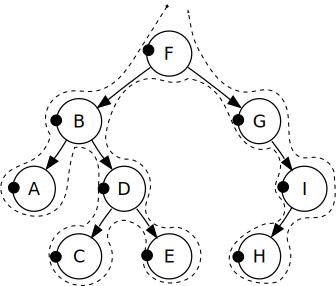

# 二叉查找/排序树

- 它是一棵二叉树，或者空树
- 左子树所有节点都小于跟节点，右子树所有节点都是大于它的根节点
- 左右子树也是一颗二叉树

二叉树的很多操作都可以使用递归来实现。递归是一种重要的编程技巧，可以简化代码实现，并使代码更易于理解。在二叉树中，递归可以用来遍历二叉树、计算二叉树深度、判断二叉树是否平衡、翻转二叉树等等。

在递归遍历二叉树时，我们首先遍历左子树，然后遍历右子树，最后访问根节点。这种遍历方式称为后序遍历。如果我们先访问根节点，然后遍历左子树，最后遍历右子树，这种遍历方式称为前序遍历。还有一种中序遍历方式，先遍历左子树，然后访问根节点，最后遍历右子树。这三种遍历方式都可以使用递归来实现。

```md
        8
      /   \
    7      9  
```

## 深度

二叉树深度是指二叉树从根节点到最深叶子节点的最长路径上的节点数。

## 宽度

maxWidth := int((1 << uint(depth)) - 1)是计算二叉树的最大宽度的代码。这行代码的作用是利用二叉树的深度depth计算出二叉树的最大宽度。

在这行代码中，我们首先使用1左移depth位，得到一个二进制数，该二进制数的最高位为1，其余位为0。然后，我们将该二进制数减去1，得到一个二进制数，该二进制数的所有位均为1。最后，我们将该二进制数转换为十进制数，并赋值给变量maxWidth，这个变量就是二叉树的最大宽度。

这个计算方法的原理是，对于一个深度为depth的二叉树，最大宽度是2^depth-1。这是因为，对于深度为depth的二叉树，它的第i层最多有2^(i-1)个节点（i从1开始计数），因此整个二叉树最多有2^depth-1个节点。而二叉树的宽度取决于最多的节点数，因此二叉树的最大宽度就是2^depth-1。

因此，在这行代码中，我们使用了1左移depth位的技巧，来得到一个深度为depth的二叉树的最大宽度。

## 遍历方式

前序遍历（Pre-Order Traversal）是依序以根节点、左节点、右节点为顺序遍历的方式。



- 深度优先遍历（前序遍历）
  F, B, A, D, C, E, G, I, H.

中序遍历（In-Order Traversal）是依序以左节点、根节点、右节点为顺序遍历的方式。


- 深度优先遍历（中序遍历）
  A, B, C, D, E, F, G, H, I.

后序遍历（Post-Order Traversal）是依序以左节点、右节点、根节点为顺序遍历的方式。


- 深度优先搜索（后序遍历）：
  A, C, E, D, B, H, I, G, F.

深度优先遍历算法是指沿着一条路径尽可能地往下走，直到不能再走为止，然后回溯到上一个节点，再沿着另一条路径继续往下走，重复这个过程直到遍历完整棵树。深度优先遍历算法主要有三种实现方式：前序遍历、中序遍历和后序遍历。

需要注意的是，深度优先遍历算法的时间复杂度为O(n)，其中n是二叉树的节点数，因为我们需要遍历每个节点一次。同时，递归实现深度优先遍历算法的空间复杂度为O(h)，其中h是二叉树的高度，因为递归调用的深度取决于二叉树的高度。而使用栈实现深度优先遍历算法的空间复杂度也为O(h)，因为栈中最多同时保存h个节点。
